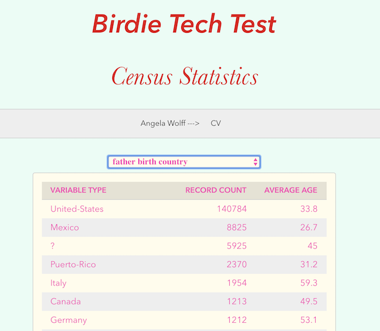

Birdie Tech Test
=========

Finished project hosted on [Heroku](https://birdie-tech-test.herokuapp.com/)

A database visualisation exercise
-----

*Required Features:*

1. Variable (field within db table) should be user selectable
2. Statistics should be displayed for variable selected:
  - count of records
  - average age
3. Statistics ordered by descending count
4. Statistics displayed to 100 with a indication of non-displayed rows
5. Must be a single page application with no reload required as variable selected

Quickstart
====
How to install the code:

- Clone this project git clone https://github.com/Whatapalaver/birdietest
- Change into the directory `cd birdietest`
- The project is split into frontend and backend folders which are self contained so to quickly install all dependencies run `npm run install:all`
- To run tests you need to cd into the frontend folder and run `npm run test`
- To start the local server cd into frontend and run `npm start`
- You can also test the hosted app on [Heroku](https://birdie-tech-test.herokuapp.com/)

Review Goals
-----

- React with concise Redux base state management
- Use of front end middleware to handle side effects/asynchronous processes (Sagas/Epics)
- Well defined and reusable components
- Effective error handling
- Some display of front end styling knowledge
- One or two automated tests
- Effective route management and reusable modular structure to your API
- Strong typing
- A good overall display of the Single Responsibility Principle
- Strong overall naming conventions

Coding Challenges
-----

API  
*I spent some time pondering how my API should be structured in order to allow React to select specific field types. Should I?*

- create one massive dump of db data
- have a separate get request for each potential field name
- pass a param back to my SQL query

*I was pretty sure that the latter was going to be the right approach and went with this option. The dropdown fieldname selector drives a call to the API in the URL format of /api/data/fieldname*

REACT
*Interesting stuff. The tricky bits were dealing with unique keys so that the virtual DOM could efficiently test for changes. Also passing props down so the main table API would refresh with the select change.*

Testing  
*As I am still fairly unfamiliar with much of the tech stack I chose not to follow a TDD approach to completing the test. Given that there was limited logic in the challenge I felt this was acceptable although I do plan to retrospectively add tests to future proof the application and to provide some assurance that everything works as desired.*

Outstanding Issues
-----

- The API calls are soooooo slow. It takes forever to load the table data. I don't know if that is to be expected or whether the delay is down to errors in my code. Perhps a single API call would be more efficient afterall.
- My API call to extract all the fieldnames for use with the Select component also includes fieldnames with no data. I should amend the query to exclude these.
- I haven't handled the restriction to 100 rows return
- I haven't used Redux and at the moment I am not sure what I would use it for
